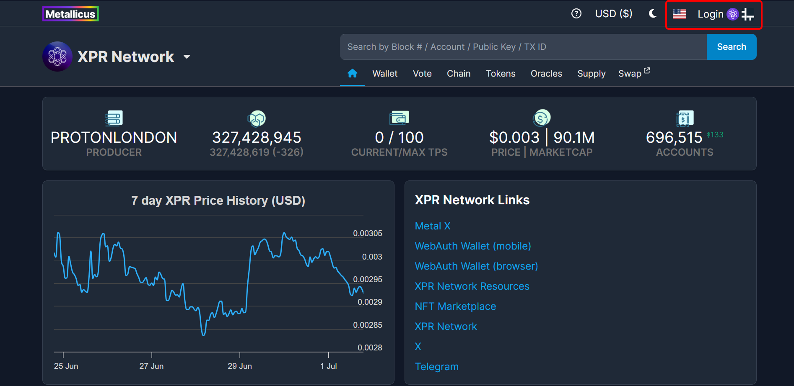

# cleos/eosc

Cleos and eosc are both command line tools used to interact with Antelope blockchain networks including [XPR Network](https://xprnetwork.org/).

You will need to visit [Antelope Leap](https://github.com/AntelopeIO/leap/releases) download and install **Leap v5.0.3** which contains and will install **keosd** and **cleos** as well.

## LOGIN TO EXPLORER USING CLEOS

### 1. Download and install the [Leap](https://github.com/AntelopeIO/leap/releases).

```
sudo apt-get update
sudo apt-get install -y ~/Downloads/leap*.deb
```

### 2. Go to [Explorer](https://explorer.xprnetwork.org/). Click Login at the top right corner.

<figure><figcaption></figcaption></figure>

### 3. Select cleos in the Connect To Wallet pop up window.&#x20;

<figure><figcaption></figcaption></figure>

### 4. Enter your account name&#x20;

<figure><figcaption></figcaption></figure>

### 5. Confirm that you are successfully logged in.

<figure><figcaption></figcaption></figure>

You should see your account username in the top right corner if you have successfully logged in.

### 6. Do a transaction - copy and paste the cleos command.&#x20;

<figure><figcaption></figcaption></figure>

