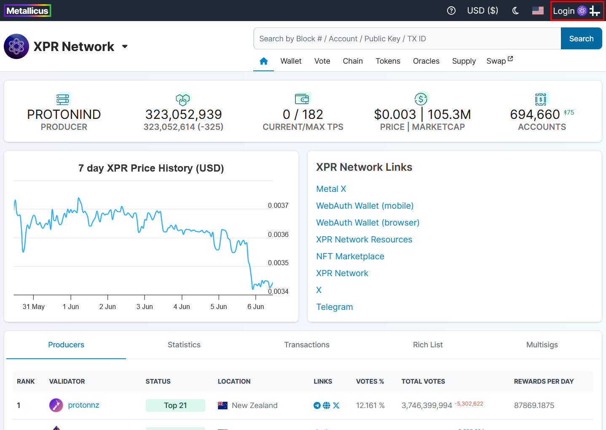

# WebAuth

The Official XPR Network wallet by [Metallicus](https://metallicus.com/) allows you to send, receive and stake the native network token XPR as well as a huge range of Metallicus wrapped xTokens and other digital assets.

### LOGIN TO XPR NETWORK EXPLORER USING WEBAUTH

#### 1. Install WebAuth application [here](https://xprnetwork.org/wallet)

#### 2. Go to XPR network explorer. Click Login at the top right corner.

<figure><figcaption></figcaption></figure>

#### 3. Select WebAuth in the Connect To Wallet pop up window.

<figure><figcaption></figcaption></figure>

####

#### 4. WebAuth will show you popup to select the type of authentication. Select the appropriate one.

<figure><figcaption></figcaption></figure>

####

#### 5. Let's try with Mobile. It will show the QR code to scan using the mobile application.

<figure><figcaption></figcaption></figure>

#### 6. Confirm that you are successfully logged in.

<figure><figcaption></figcaption></figure>

You should see your account username in the top right corner if you have successfully logged in.
