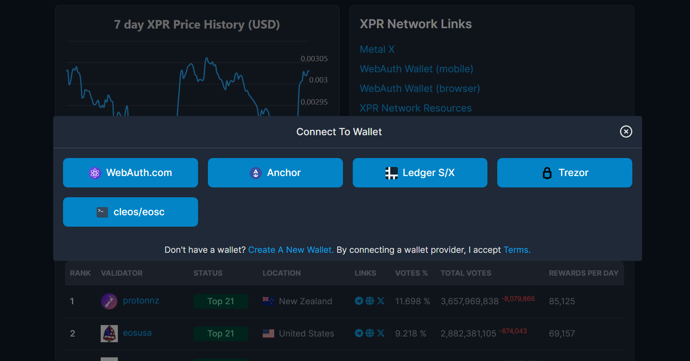
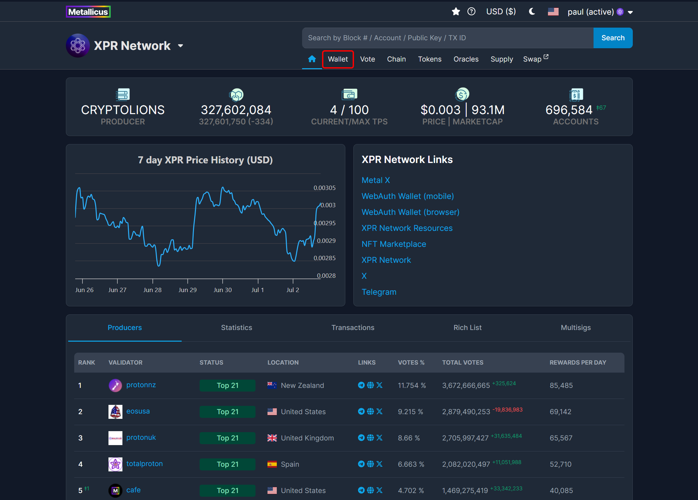
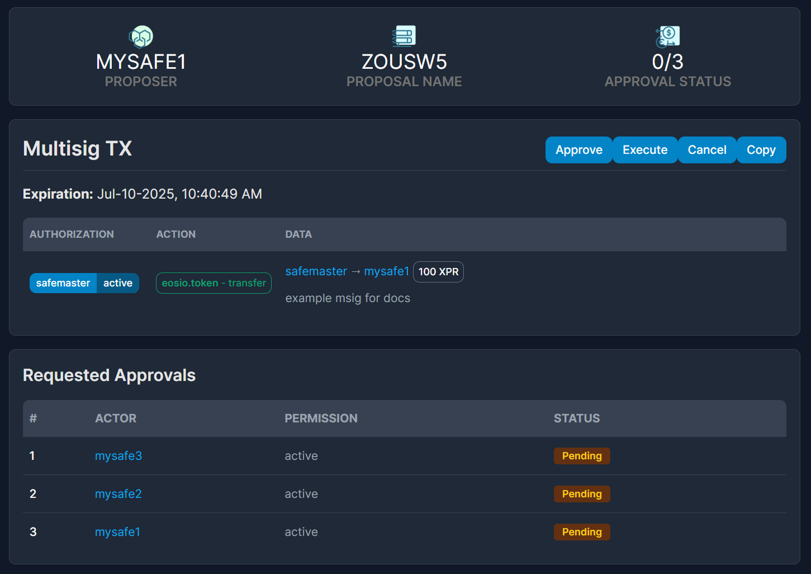
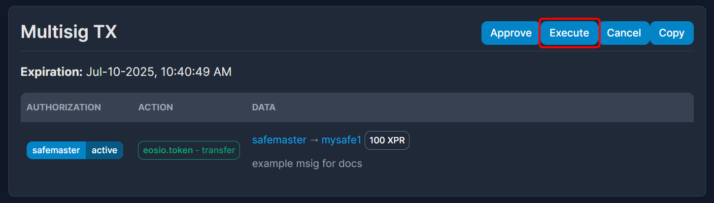

# Multi-signature (MSIG)

## HOW TO CREATE AN MSIG

### 1. Check that you are logged in to the [XPR Network Explorer](https://explorer.xprnetwork.org/) using one of the wallet options.

<figure><figcaption></figcaption></figure>

### 2. Select the dropdown menu from your account and toggle the Multisig Mode option to the on position as pictured.

<figure><figcaption></figcaption></figure>

### 3. Select **Wallet** on the top menu.

<figure><figcaption></figcaption></figure>

### 4. Transfer Token page should be the initial page under Wallet. We will demo a transfer transaction for this MSIG.&#x20;

<figure><figcaption></figcaption></figure>

Fill out the 3 fields and click the Transfer button to complete transaction.

<figure><figcaption></figcaption></figure>

### 5. You will be taken to a new page to Propose Multisig Transaction.

The Multisig page will have 4 fields to fill in;

* Proposer - The account you are proposing the multisig from.
* Proposal Name - Name of the proposal and can be 2-12 characters long.
* Requested Approvals - List which accounts can prove this transaction. These are accounts listed as authorizations. This field is required to do a proposal.
  * Actor - Account name
  * Permission - Owner or Active
* Authorization
  * Actor
  * Permission

<figure><figcaption></figcaption></figure>

Depending on the permissions setup on the account you are initiating the multisig transfer from, the Requested Approvals should automatically be filled out. If not, enter the from account in the Authorization field and check again.

You can also manually update the Requested Approvals fields.

When you are ready to Propose the multisig click the blue button Propose and sign the transaction with your wallet.

<figure><figcaption></figcaption></figure>

You will receive a Success message along with a transaction hash to check the completed action and a **link to check the proposal.** You can share your MSIG with this link provided.

<figure><figcaption></figcaption></figure>

The link to the proposal will show the proposal in detail, with the Proposer, Proposal Name, Approval Status and the current Request Approvals by the account(s) and their individually status.

The **Approve Transaction** button is for anyone who is listed as a Requested Approval to Approve Transaction after review.

The **Execute Transaction** button is for anyone to execute once the signing threshold has been reached.

If your multisg account has a threshold of (2) then the multisig will require 2 signer accounts to Approve the transaction before you can Execute the multisig.

### 6. Approve and execute your proposal by toggling off MSIG mode from the dropdown list on the right corner and signing in or sending the proposal link to the Account holder for approval.

<figure><figcaption></figcaption></figure>

<figure><figcaption></figcaption></figure>

If you are logged into an account that is listed as one of the Request Approvals, find the proposal and click Approve Transaction.

<figure><figcaption></figcaption></figure>

Once the Approval Status reaches the minimum threshold, you can now execute the transaction. Press Executive Transaction.

<figure><figcaption></figcaption></figure>

You will receive a Success message with a transaction hash attached. You can also search up the account and verify transaction to see if the transfer has been executed.

For a more detailed guide to creating a multi-sig transaction on the XPR Network please follow [this tutorial](https://xprnetwork.org/blog/how-to-secure-your-account-with-native-2-of-3-multisig).

