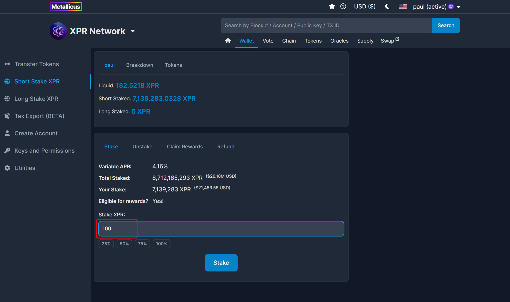
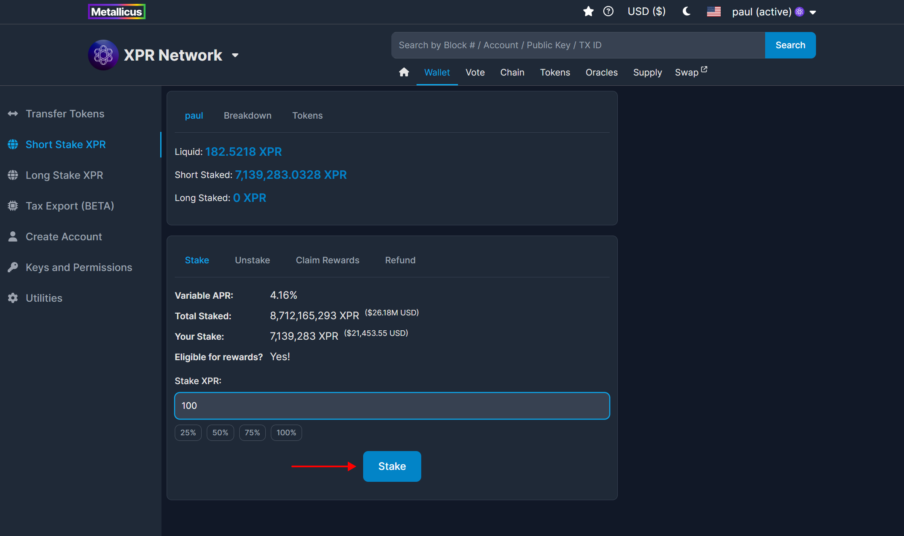
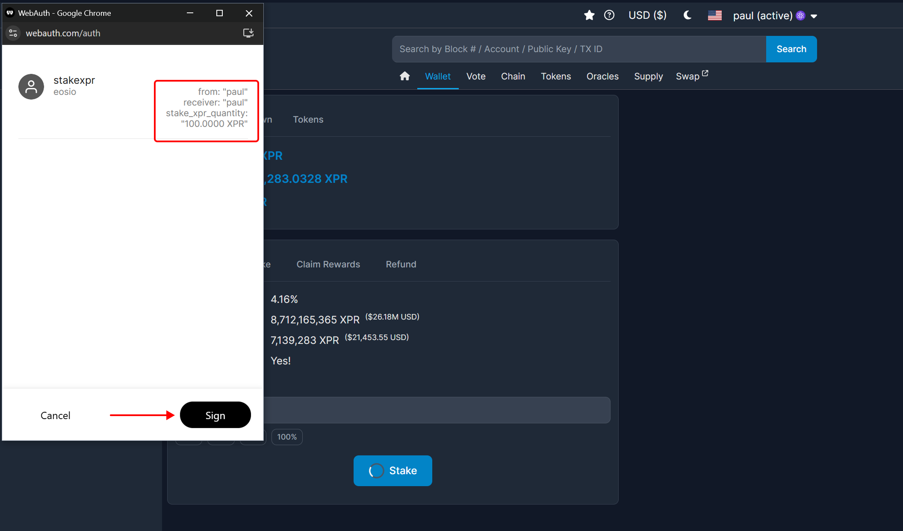
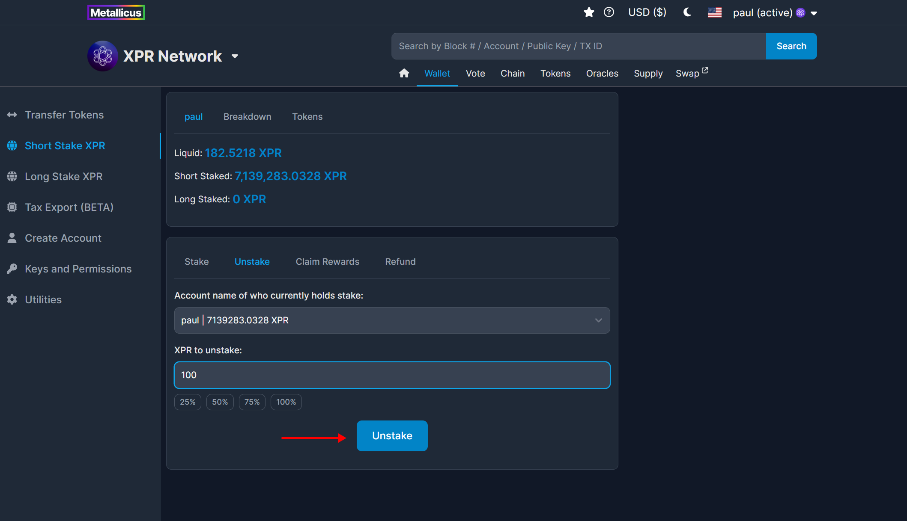

# Staking + Unstaking

Staking on XPR Network allows token holders to actively participate in network governance and support the security and decentralization of the blockchain through **Delegated Proof of Stake (DPoS)**.

When you stake your XPR, you’re helping shape the future of the network by voting for **Block Producers,** the entities responsible for validating transactions and maintaining the network. Stakers are required to vote for **at least 4 Block Producers**. While voting is mandatory for staking, the specific Block Producers you select **do not impact the amount of staking rewards you receive**. View the full list of active [Block Producers here](https://explorer.xprnetwork.org/).

Staking rewards are distributed automatically and proportionally based on the amount of XPR you have staked. Voting is about governance, not reward optimization - it’s your opportunity to influence who runs the network and how it evolves.&#x20;

Governance and voting take place at [**gov.xprnetwork.org**](https://gov.xprnetwork.org), where you can view active Governance Proposals, cast your votes, and stay informed about important network changes.


The process of unstaking your XPR takes a **total of 24 hours** from the moment you click unstake to when you will have full access to move the XPR. This is a security feature to add a one-day buffer incase your keys may be compromised. Staking your XPR can add this layer of security for your account. If a hacker gets hold of your wallet or active key and tries to unstake your XPR, users can use their owner permission key to overwrite and change the active permission key before the 24-hour unstaking period if complete.


## HOW TO STAKE XPR

### 1. Select **Wallet** on the top menu.

<figure><figcaption></figcaption></figure>

### 2. Select **Short Stake XPR** from the left side menu.

<figure><figcaption></figcaption></figure>

The Short Stake XPR page should show four tabs;

* **Stake** - Use this page to stake XPR
* **Unstake** - Use this page to unstake XPR
* **Claim Rewards** - Claim your XPR Short Staking rewards once every 24 hours.
* **Refund** - Refund is when it has been 3 days or more since you have unstaked and the action has gotten stuck.

**Note:** You must be logged into the [explorer](https://explorer.xprnetwork.org/wallet/staking/stake) before you can Stake XPR

### 4. Enter in the **Amount of XPR to Stake**

To make the process more simple, there are buttons to select a percentage of your XPR holdings - 25, 50, 75 and 100%.

<figure><figcaption></figcaption></figure>

### 5. Click the blue button Stake to confirm the amount of XPR you are staking and sign the transaction

<figure><figcaption></figcaption></figure>

You can use the [WebAuth.com](https://webauth.com/) Wallet signing window to view the smart contract, actions and parameters on before confirming the transaction. When you are ready, click Sign.

<figure><figcaption></figcaption></figure>

## HOW TO UNSTAKE XPR

### 1. Select **Wallet** on the top menu.

<figure><figcaption></figcaption></figure>

### 2. Select **Short Stake XPR** from the left side menu.

<figure><figcaption></figcaption></figure>

### 3. Select the Unstake tab.

Enter the amount of XPR you wish to unstake.

**Note:** It takes 24 hours to unstake your XPR before you can use it again.

<figure><figcaption></figcaption></figure>

### 4. Press the blue button Unstake to complete transaction.

Click Unstake and Sign the transaction with your [WebAuth.com](https://webauth.com/) Wallet (or compatible wallet)

<figure><figcaption></figcaption></figure>

## REFUND

If you followed the above instructions to unstake XPR, you should receive the amount in **24 hours**. You can check how much you will be receiving and how much time is left on the Refund tab in [Short Stake XPR](https://explorer.xprnetwork.org/wallet/staking/refund). If for whatever reason, you did not receive the refund amount back, check back on this page and click the blue Refund button to manually process the refund.

<figure><figcaption></figcaption></figure>

