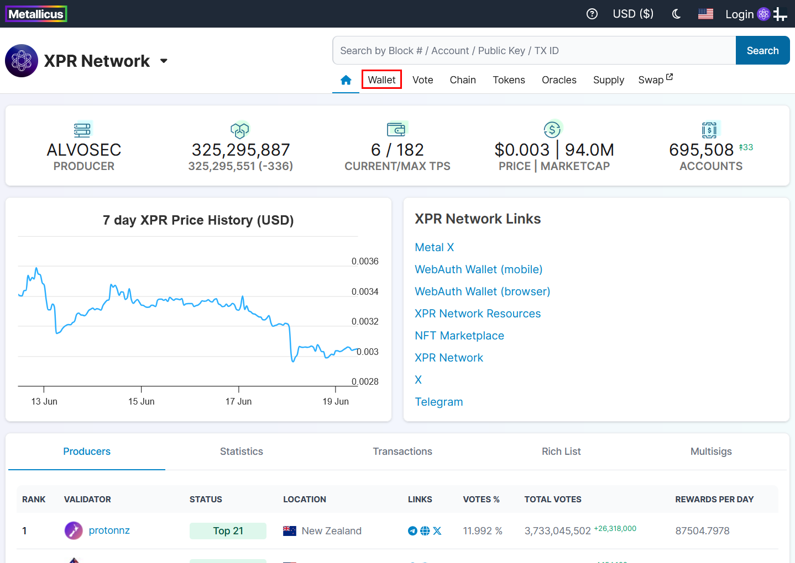
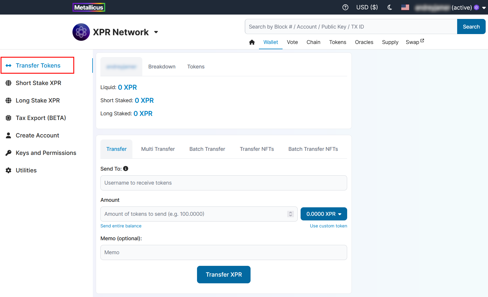
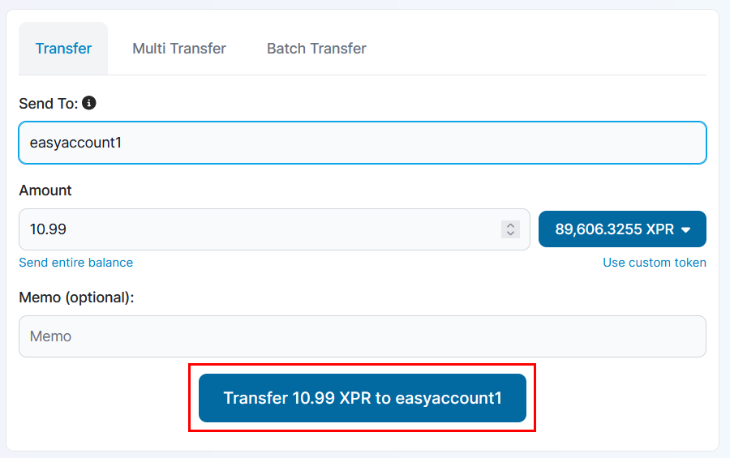

# Transfer

XPR Network's DPOS consensus mechanism allows free (no gas fees), quick and easy transfers between accounts. The XPR Network Explorer's [wallet](https://explorer.xprnetwork.org/wallet/transfer) functions allow users to transfer tokens in 3 easy steps.

## HOW TO TRANSFER

### 1. Select **Wallet** on the top menu.

<figure><figcaption></figcaption></figure>

### 2. Transfer Tokens page should be the initial page under Wallet. (If for whatever reason it is not, select **Transfer Tokens** from the left side menu.)

<figure><figcaption></figcaption></figure>

The Transfer Tokens page has 3 fields for you to fill in;

* **Send To** - Username to receive tokens.
* **Amount** - Amount of tokens to send to the receiver. Clicking on the blue button on the right will display a drop down list of all the tokens you own on the account.
  * Selecting **Use custom token** will allow you to manually enter the **Symbol of token** (e.g. XPR) and **Contract of token** (e.g. eosio.token)
  * You can select **Send entire balance** to autofill the amount.
* **Memo (optional)** - You can send a memo with your transfer.&#x20;

### 3. Click on the "Transfer _AMOUNT_ to _USERNAME"_ blue button to complete transfer.

<figure><figcaption></figcaption></figure>

