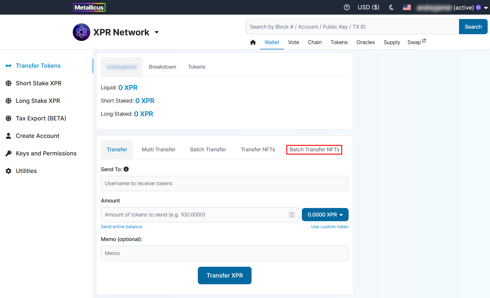
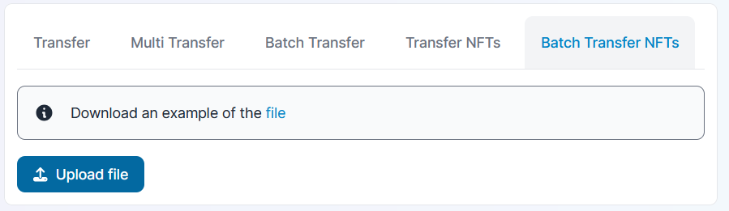

# Batch Transfer NFTs

### Go to Wallet → Transfer tokens page

### Switch to Batch Transfer NFTs tab in top menu of the page

<figure><figcaption></figcaption></figure>

### Prepare CSV file using the example on the page and upload it

<figure><figcaption></figcaption></figure>

The template for CSV is the following: `to, assetId, memo`

### Check the results table and click Transfer button

<figure><figcaption></figcaption></figure>

