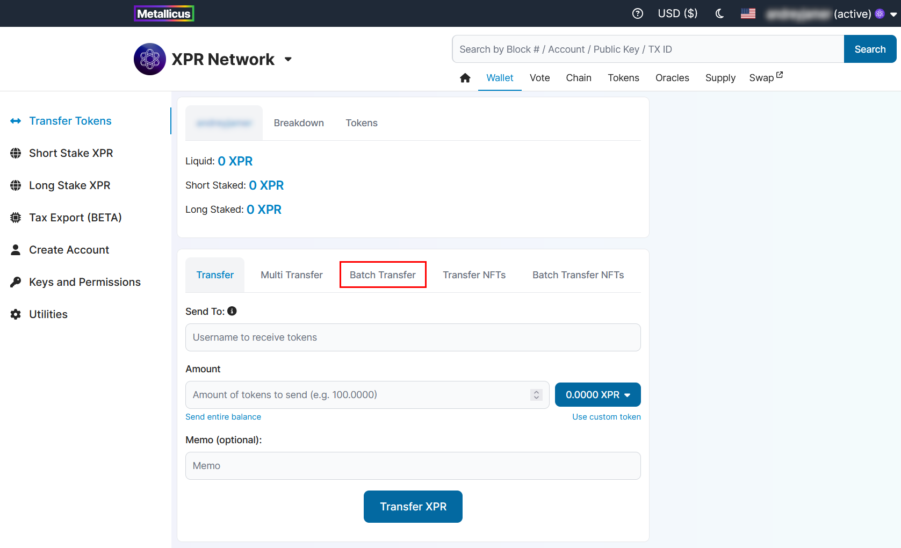
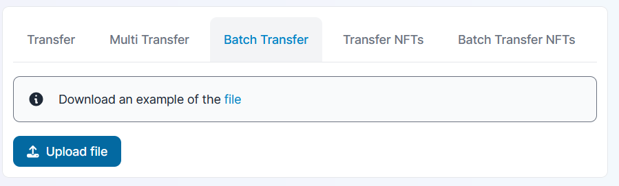
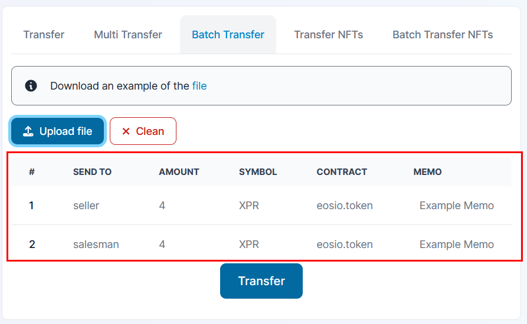
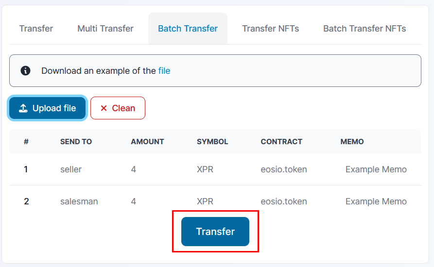

# Batch transfer

## HOW TO TRANSFER TOKENS TO MULTIPLE ACCOUNTS

### Go to Wallet → Transfer tokens page

### Switch to Batch transfer tab in top menu of the page

<figure><figcaption></figcaption></figure>

### Prepare CSV file using the example on the page and upload it

<figure><figcaption></figcaption></figure>

The template for CSV is the following: `to, amount, token, contract, memo`

### Check the results table

<figure><figcaption></figcaption></figure>

### Click Transfer button

<figure><figcaption></figcaption></figure>
