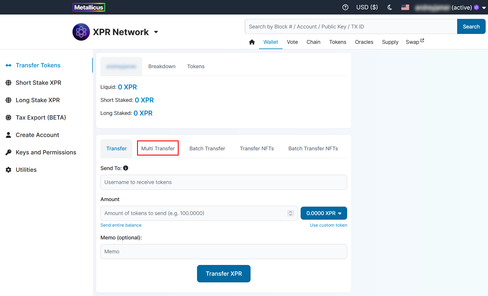
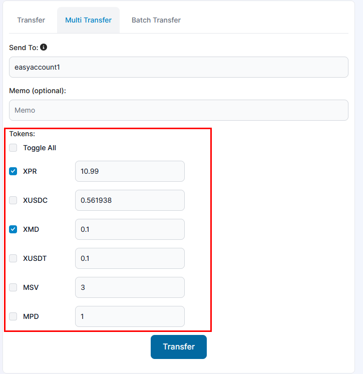
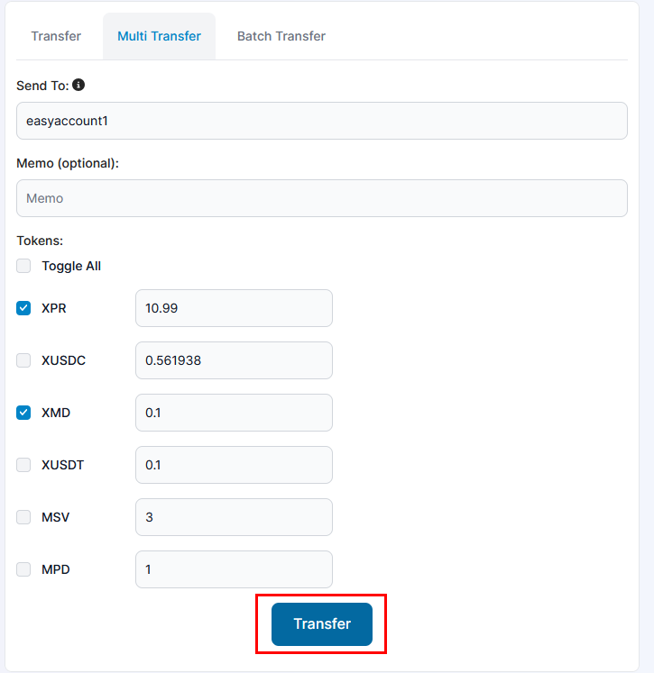

# Multi transfer

## HOW TO TRANSFER MULTIPLE TOKENS

### 1. Go to Wallet → Transfer tokens page

### 2. Switch to Multi transfer tab in top menu of the page

<figure><figcaption></figcaption></figure>

This page has 2 fields for you to fill in;

* **Send To** - Username to receive tokens.
* **Memo (optional)** - You can send a memo with your transfer.

### 3. Select tokens you want to transfer and put the amount in front of each selected token.

<figure><figcaption></figcaption></figure>

### 4. Click Transfer button

<figure><figcaption></figcaption></figure>
