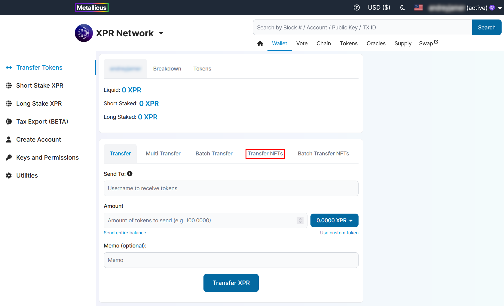
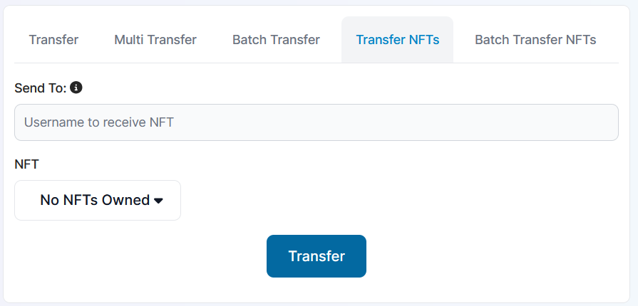

# Transfer NFTs

### Go to Wallet → Transfer tokens page

### Switch to Transfer NFTs tab in top menu of the page

<figure><figcaption></figcaption></figure>

This page has 2 fields for you to fill in;

* **Send To** - Username to receive NFTs.

<figure><figcaption></figcaption></figure>

### Select NFT to transfer an click Transfer button
